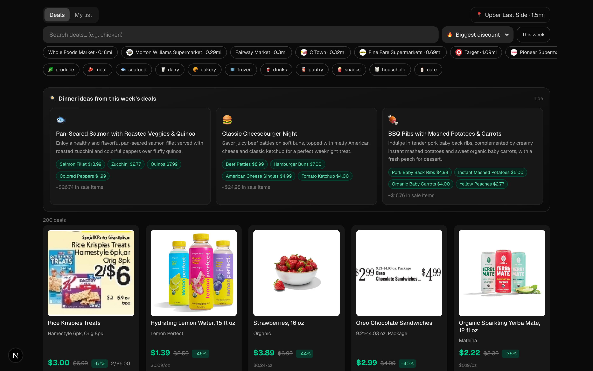
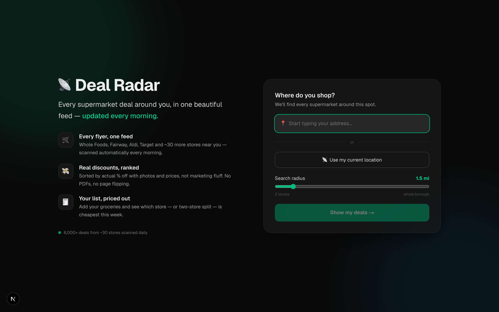
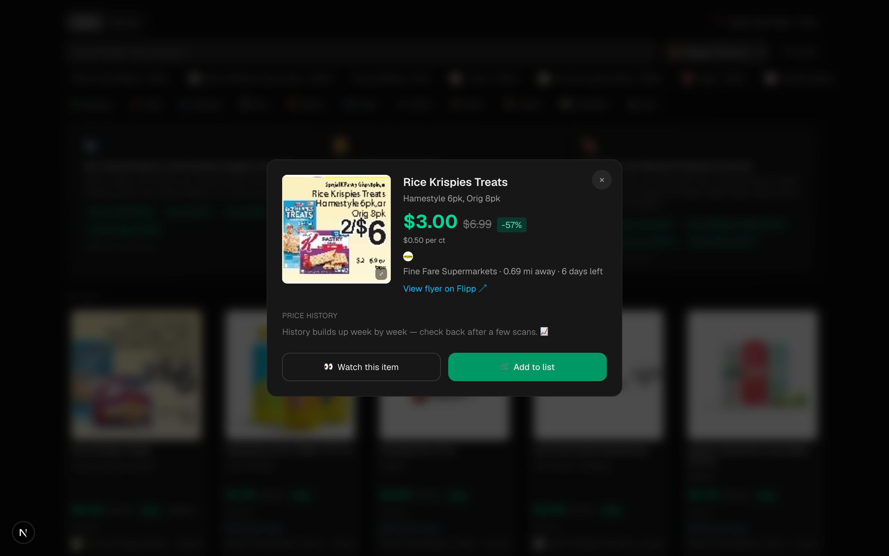
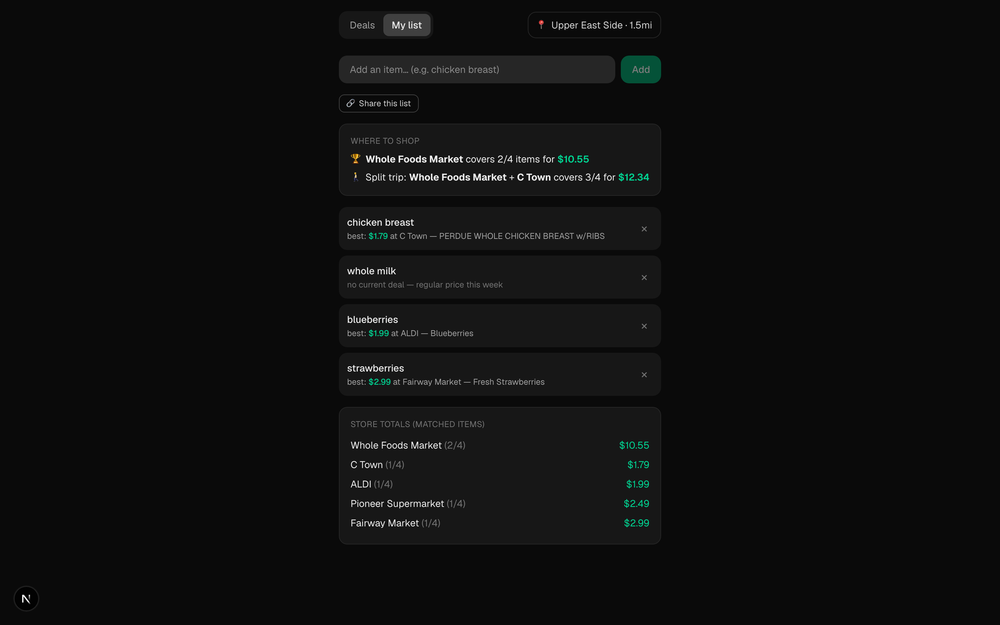
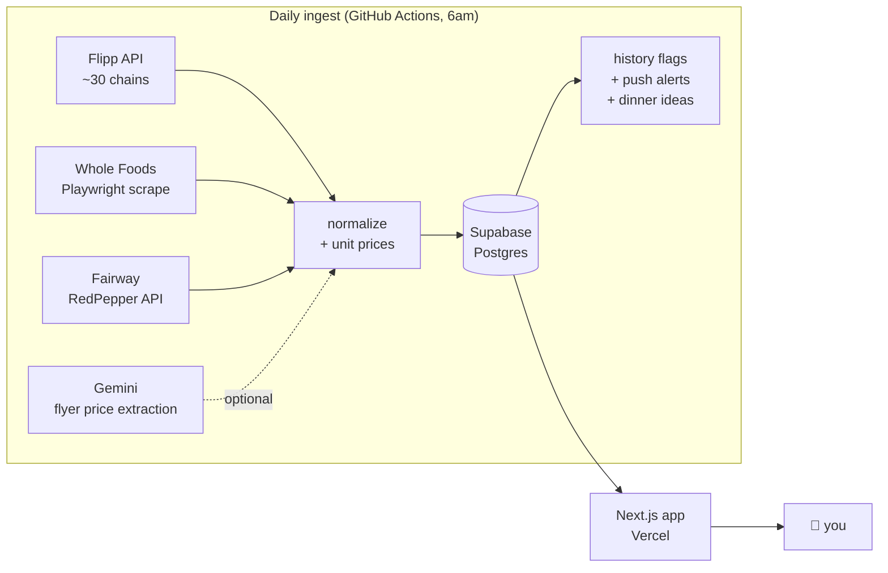

# 📡 Deal Radar

**Every supermarket deal around you, in one feed — scanned automatically every morning.**

Enter your address once. Deal Radar finds every grocery store within your radius, reads all of
their weekly flyers (including the painful PDF flip-book ones), and gives you one clean,
searchable feed of real deals with photos, prices, and discounts — plus a shopping list that
tells you which store is cheapest this week.

Built as a personal tool, running entirely on free tiers: **$0/month**.



## Features

- 🛒 **One feed for every store** — ~30 grocery chains via Flipp, plus dedicated adapters for
  Whole Foods (with Prime pricing) and Fairway (whose flip-book circular becomes clean cards
  with the printed flyer price as the image)
- 🔍 **Search + smart sorting** — biggest discount, lowest price, or ending soon; emoji
  category filters; store chips with logos and real walking distances (OpenStreetMap)
- ⚖️ **Unit prices** — $/oz, $/lb computed from package sizes so deals are actually comparable
- 🏷️ **Historical-low badges** — price history accumulates weekly; genuine lows get flagged,
  recurring fake "sales" don't
- 🔢 **Multi-buy done right** — "4/$1" means $0.25 each, not $1 (Flipp's feed drops the
  prefix; we re-fetch item details for nearby stores to get the truth)
- 🧾 **Shopping list comparison** — best single store, best two-store split, per-item best
  prices; shareable via a 6-char code so the whole household edits one list
- 👀 **Watches + push notifications** — watch "chicken breast" and your phone buzzes the
  morning it goes on sale (Web Push, works as an installed PWA on iOS)
- 🍳 **Dinner ideas from this week's deals** — three weeknight recipes generated from what's
  actually on sale, with ingredient→deal chips and estimated cost (optional, Gemini free tier)
- 📈 **Price history sparklines**, deal detail sheets with links to the source flyer,
  expandable images (Fairway zooms to the full flyer page in context)
- 📲 **Installable PWA**, mobile-first, dark UI

| Landing | Deal detail | List comparison |
|---|---|---|
|  |  |  |

## How it works



- **No paid scraping services.** The sources are the same JSON feeds the stores' own flyer
  widgets use, discovered by watching network traffic. Adapters are pluggable
  (`lib/sources/*` implement one small `DealSource` interface).
- **Data survives flakiness**: per-source error isolation, Overpass mirror fallback,
  extraction-price preservation across rate limits, idempotent upserts.
- **History is free**: deals upsert daily with validity windows, so price history, "lowest in
  N weeks" badges, and sparklines simply emerge over time.

## Quick start

Prereqs: Node 22+, a free [Supabase](https://supabase.com) project.

```bash
git clone https://github.com/ozansozuozgit/deal-radar && cd deal-radar
npm install
cp .env.example .env.local          # fill in Supabase URL + service key, your location
# apply supabase/schema.sql and supabase/migrations/*.sql in the Supabase SQL editor
npx playwright install chromium     # for the Whole Foods scrape
DOTENV_CONFIG_PATH=.env.local npx tsx scripts/ingest/run.ts   # first scan (~2 min)
npm run dev                         # open http://localhost:3000
```

To find your Whole Foods store id: `npx tsx scripts/wf-find-store.ts <store-page-slug>`
(slug from wholefoodsmarket.com/stores/…).

### Deploy (free)

1. **Vercel**: import the repo, add `SUPABASE_URL` + `SUPABASE_SERVICE_ROLE_KEY` env vars.
2. **GitHub Actions**: add the same as repo secrets plus your `INGEST_*` location values —
   the [ingest workflow](.github/workflows/ingest.yml) runs daily at 6am ET.
3. Optional extras (all free): `GEMINI_API_KEY` (Fairway prices + dinner ideas), VAPID keys
   (`npx web-push generate-vapid-keys`) for push alerts, a fine-grained GitHub PAT for the
   in-app "Refresh now" button. See [.env.example](.env.example).

## Tests

```bash
npm test        # ~100 unit tests, offline (captured API fixtures in fixtures/)
npm run e2e     # Playwright end-to-end against a local dev server
```

## Coverage & caveats

- Store coverage is best in the **US/Canada** (anywhere Flipp has flyers). The Whole Foods and
  Fairway adapters are NYC-flavored examples of wrapping a store that isn't on Flipp.
- This reads **unofficial endpoints** — the same ones the stores' public flyer pages call.
  They can change or rate-limit at any time; adapters fail independently and the app keeps
  serving the last good data. Built for personal use; be a good citizen with request volume.
- Trader Joe's and other no-flyer stores simply don't appear (they don't publish deals).
- Not affiliated with Flipp, Whole Foods, Fairway, or anyone else. Prices belong to the
  stores; verify in store.

## License

[MIT](LICENSE)
